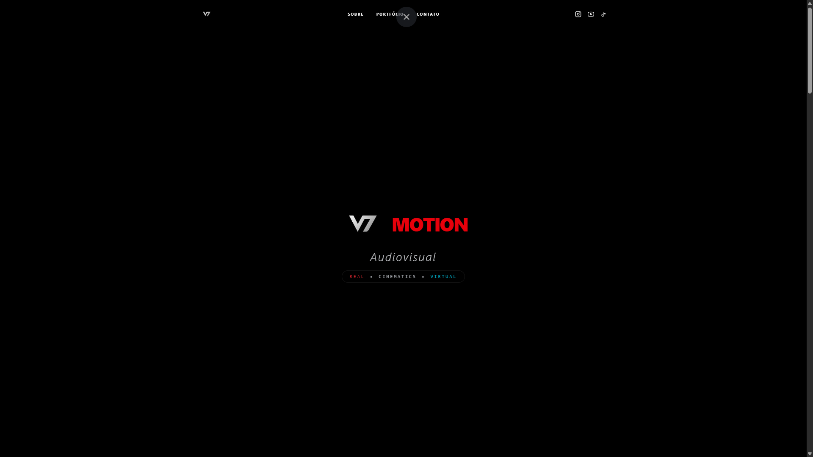
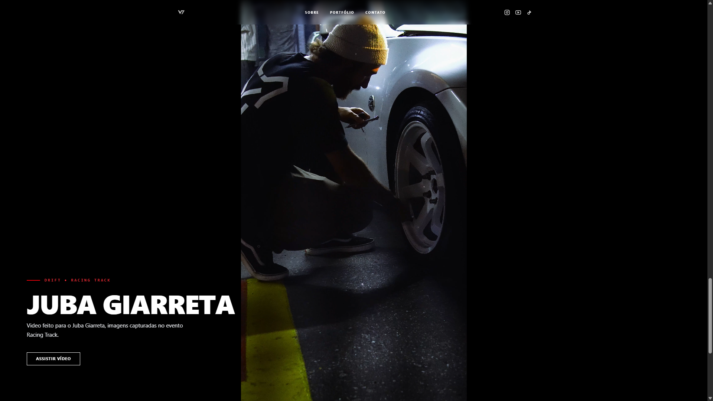

# 🎬 V7 Motion | Portfólio Audiovisual Automotivo

> **Portfólio de alta performance e renderização dinâmica para Filmmakers do nicho automotivo.**

Este projeto é uma aplicação web imersiva desenvolvida para exibir produções audiovisuais (focadas em Drift Real e Simuladores). Ele utiliza Supabase para armazenamento e gerenciamento de dados, garantindo otimização extrema de mídia e integração direta com o WhatsApp para captação de clientes.

---

## 📸 Galeria do Projeto

| Layout Imersivo (Tela Cheia) | Smart Media (Vídeos Verticais) |
|:---------------------:|:-------------------------:|
| *Design focado na retenção e impacto visual* | *Background com blur e mídia original centralizada* |
|  |  |

---

## 🚀 Funcionalidades

### ⚙️ Motor Dinâmico de Conteúdo (Supabase)
* **Gestão Simplificada:** O portfólio é alimentado por um banco de dados Supabase. O usuário pode adicionar novos vídeos ou ensaios fotográficos via painel admin, sem precisar alterar o HTML.
* **Filtros em Tempo Real:** Sistema inteligente (Vanilla JS) que alterna entre as categorias ("Vida Real" vs "Simulador") e tipos de mídia ("Vídeos" vs "Fotos") de forma instantânea, manipulando o DOM sem recarregar a página.

### 🎥 Otimização de Mídia e Performance
* **Smart Media Rendering:** Mídias no formato 9:16 (TikTok/Reels) recebem um tratamento especial. O sistema gera um background em escala com filtro *blur* e centraliza a mídia original no topo, evitando que o vídeo ou foto fique pixelado ou com cortes (como a cabeça do piloto ou o carro).
* **Lazy Video (Intersection Observer):** Para evitar que o navegador trave processando dezenas de vídeos ao mesmo tempo, uma API nativa monitora o scroll da página. Vídeos que estão fora da tela são pausados automaticamente e só reproduzem quando entram no campo de visão do usuário.

### 💬 Conversão e UI/UX
* **Integração com WhatsApp:** O formulário intercepta os dados preenchidos, aplica formatações de texto (negrito e itálico) e gera um link parametrizado que abre direto na API do WhatsApp, acelerando o orçamento.
* **Modais de Galeria (Lightbox):** Visualização de ensaios fotográficos com suporte a navegação em tela cheia e zoom dinâmico, mantendo a imersão do usuário.

---

## 🛠️ Tecnologias Utilizadas

* **Frontend:** HTML5, Tailwind CSS.
* **Linguagem:** JavaScript (ES6+) "Vanilla" (Sem dependência de bibliotecas ou frameworks pesados).
* **Data Fetching:** API do Supabase para consumo dinâmico de dados.

---

💼 **Desenvolvido por Gustavo Modulo** | [LinkedIn](www.linkedin.com/in/gustavo-modulo) | [GitHub](https://github.com/GustavoModulo)